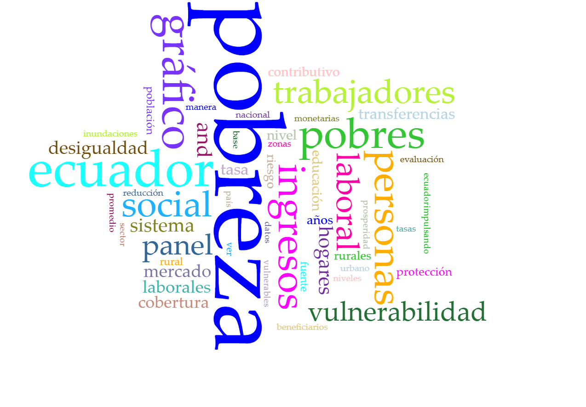

<!-- ---
title: "Análisis y visualización"
format: html
execute:
  freeze: false

---
``` {python}
#| echo: false
#| warning: false
#| message: false

import pandas as pd
import altair as alt
from PIL import Image
import matplotlib.pyplot as plt 
import json
from collections import defaultdict

alt.data_transformers.disable_max_rows()
df = pd.read_csv("./basesdedatos/ENEMDU_2019-2025_CLEAN.csv")
df["periodo"] = df["periodo"].astype(int)
df["fexp"] = pd.to_numeric(df["fexp"])
```
## Ingresos y pobreza
   
**Pregunta analítica:**  
¿Cuál es la relación entre el ingreso laboral y la pobreza?

```{python}
#| echo: false
#| warning: false
#| message: false   
df=df[df['ingrl']>0]
df=df[df['ingpc']>0]
base = (
    alt.Chart(df)
    .mark_circle(size=40, opacity=0.5)
    .encode(
        x=alt.X(
            "ingrl:Q",
            title="Ingreso laboral ",
            scale=alt.Scale(zero=False)
        ),
        y=alt.Y(
            "ingpc:Q",
            title="Ingreso per cápita ",
            scale=alt.Scale(zero=False)
        ),
        tooltip=[
            alt.Tooltip("ingrl:Q", title="Ingreso laboral", format=",.0f"),
            alt.Tooltip("ingpc:Q", title="Ingreso per cápita", format=",.0f")
        ]
    )
) 
scatter_pobres = (
    base
    .transform_filter(alt.datum.pobreza == 1)
    .properties(
        title="Personas pobres"
    )
)
scatter_pobres.properties(width='container').interactive()
```

```{python}
#| echo: false
#| warning: false
#| message: false   
scatter_no_pobres = (
    base
    .transform_filter(alt.datum.pobreza == 0)
    .properties(
        title="Personas no pobres"
    )
)
scatter_no_pobres.properties(width='container').interactive()
```

### Interpretación

El gráfico muestra una relación inversa clara entre el nivel de ingresos y la incidencia de la pobreza: a mayores ingresos laborales, menores tasas de pobreza.

## Análisis textual

{width=1000} 

Como complemento al análisis cuantitativo, se utilizó **Voyant Tools** para explorar el lenguaje y los conceptos predominantes en documentos institucionales relacionados con pobreza y empleo.

Este análisis permite contextualizar estadísticamente los hallazgos y observar cómo el discurso institucional ha incorporado temas como vulnerabilidad, empleo y protección social en los años posteriores a la pandemia.

## Síntesis de hallazgos

Las visualizaciones presentadas permiten concluir que:

- La pandemia marca un punto de inflexión claro en la evolución de la pobreza.
- Existen desigualdades persistentes entre áreas urbanas y rurales.
- La pobreza está estrechamente vinculada a la precariedad laboral y al nivel de ingresos.
- Los patrones laborales refuerzan la necesidad de políticas diferenciadas por región y actividad de ocupación. -->